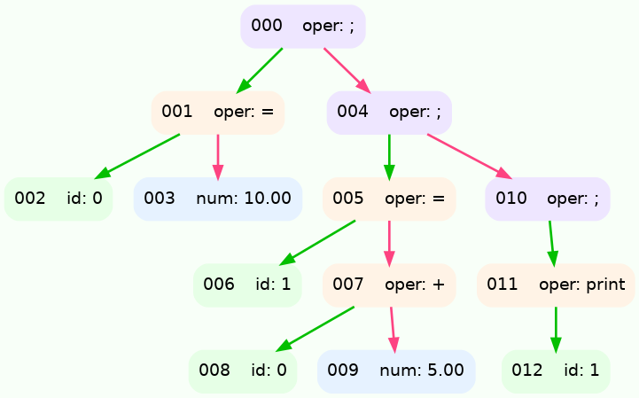
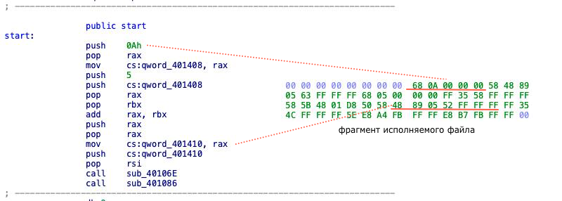

# Краткий обзор
**Основной целью** этого проекта являлось написание **компилятора** для нашего [языка](https://github.com/asssh52/yazik), иными словами *x86-64 backend*, создающий исполняемый ELF64-файл и ассемблерный листинг.

Компилятор получает на вход AST(Abstract Syntax Tree)-дерево сгенерированное и оптимизированное *front-end & middle-end*'ами [языка](https://github.com/asssh52/yazik). Далее компилятор совершает обход этого дерева и транслирует узлы в ассемблерные инструкции и бинарный код.

## Микроархитектура нашего исполняемого файла

- **ELF64** Header
- **ELF64** Programm header
- **stdlib** - наша стандартная библиотека
- Место для хранения глобальных переменных
- Вспомогательный буфер
- Код программы пользователя

Из главных отличий нашей архетиктуры исполняемого файла от выдаваемых промышленными компиляторами файлов определённо стоит отметить:

-  расположение 'секции' с глобальными переменными находится в той же части программы, где находится исполняемый код, такое решение вынуждает выставить флаги в **Programm header**'е с разрешениями **READ/WRITE/EXECUTE**, хотя обычно компиляторы разделяют эти секции на **.text** с **READ/EXECUTE** и **.data** с **READ/WRITE**.

- генерируемый исполняемый код программы пользователя не использует абсолютной адресации, вследствие чего является полностью перемещаемым.

Стандартная библиотека включает в себя несколько необходимых для трансляции функций, предусмотренных языком, таких как вывод десятичного числа и завершение программы.

### Пример трансляции кода

Код на *brainrotlang*:
```
a = 10$
b = a + 5$

sigma b$
@
```

<details>
<summary>AST-дерево</summary>

```
{OP:";"
	{OP:"="
		{ID:"a"}
		{NUM:"10"}
	}
	{OP:";"
		{OP:"="
			{ID:"b"}
			{OP:"+"
				{ID:"a"}
				{NUM:"5"}
			}
		}
		{OP:";"
			{OP:"print"
				{ID:"b"}
			}
		}
	}
}
```


</details>
<br>
<details>
<summary>NASM-листинг</summary>

```asm
push 10                         ;line:598	node:003
pop rax                         ;line:556	node:002
mov qword [_0], rax             ;line:557	node:002
                                ;line:944	node:001
push 5                          ;line:598	node:009
push qword [_0]                 ;line:581	node:008
pop rax                         ;line:852	node:007	 ПЛЮС

pop rbx                         ;line:853	node:007
add rax, rbx                    ;line:854	node:007
push rax                        ;line:855	node:007
pop rax                         ;line:556	node:006
mov qword [_1], rax             ;line:557	node:006
                                ;line:944	node:005
push qword [_1]                 ;line:581	node:012
pop rsi                         ;line:922	node:011	 ПЕЧАТЬ
call [std + 8]                  ;line:923	node:011	 ПЕЧАТЬ
                                ;line:939	node:010
                                ;line:939	node:004
                                ;line:939	node:000
call [std + 16]
```
</details>
<br>
Для получения картинки ниже использовался дизассемблер IDA.
<br>


<div align="center">
Код программы пользователя в исполняемом файле.
</div>

### Полезные/использованные ссылки
- [Кодировка x86-64 команд](https://wiki.osdev.org/X86-64_Instruction_Encoding#ModR.2FM)
- [Фрагмент документации Intel](https://studfile.net/preview/1583048/page:5/#14)
- [Описание структуры ELF-файлов](https://ru.wikipedia.org/wiki/Executable_and_Linkable_Format)
- [Статья про ELF-файлы](https://habr.com/ru/articles/480642/)
