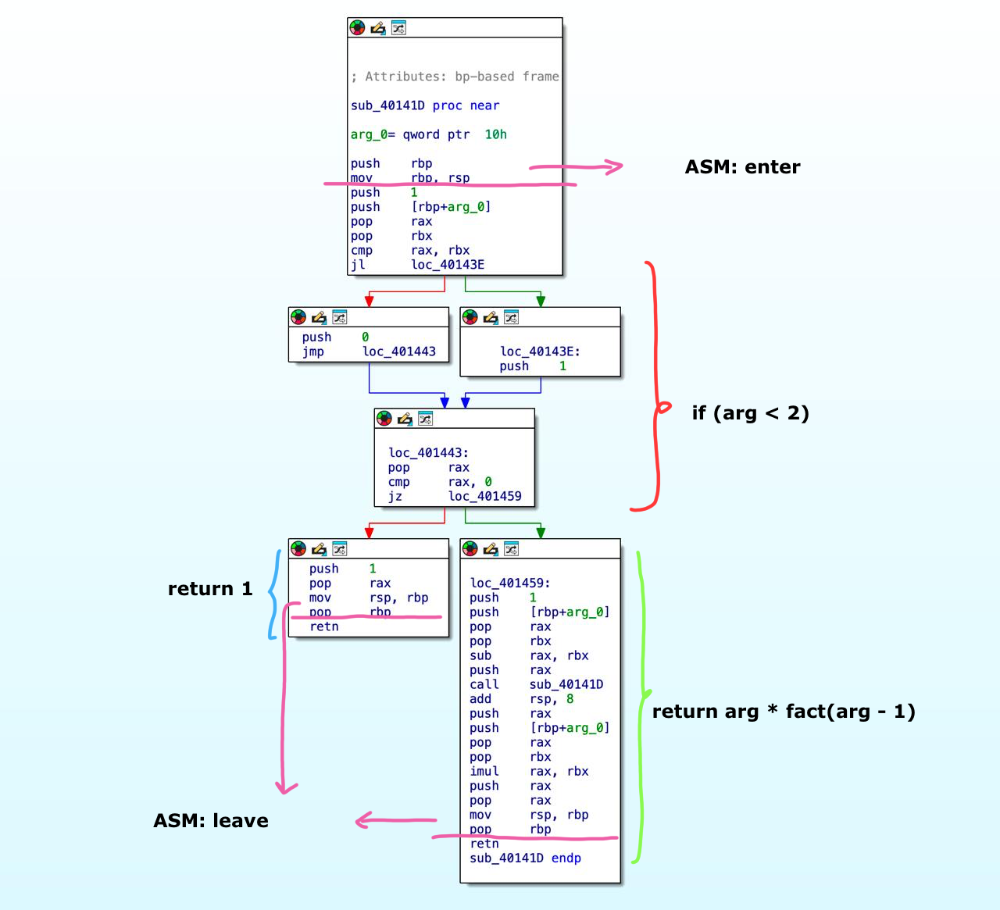

# Краткий обзор
**Основной целью** этого проекта являлось написание **компилятора** для нашего [языка](https://github.com/asssh52/yazik), иными словами *x86-64 backend*, создающий исполняемый ELF64-файл и ассемблерный листинг.

Компилятор получает на вход AST(Abstract Syntax Tree)-дерево сгенерированное и оптимизированное *front-end & middle-end*'ами [языка](https://github.com/asssh52/yazik). Далее компилятор совершает обход этого дерева и транслирует узлы в ассемблерные инструкции и бинарный код.

## Микроархитектура нашего исполняемого файла

- **ELF64** Header
- **ELF64** Program header
- **stdlib** - наша стандартная библиотека
- Место для хранения глобальных переменных
- Код программы пользователя

Из главных отличий нашей архитектуры исполняемого файла от выдаваемых промышленными компиляторами файлов определённо стоит отметить:

-  расположение 'секции' с глобальными переменными находится в той же части программы, где находится исполняемый код, такое решение вынуждает выставить флаги в **Programm header**'е с разрешениями **READ/WRITE/EXECUTE**, хотя обычно компиляторы разделяют эти секции на **.text** с **READ/EXECUTE** и **.data** с **READ/WRITE**.

- генерируемый исполняемый код программы пользователя не использует абсолютной адресации, вследствие чего является перемещаемым.

Стандартная библиотека включает в себя несколько необходимых для трансляции функций, предусмотренных языком, таких как вывод десятичного числа и завершение программы.

Из важных фишек, хочется отметить, что за счёт поддерживания общего стандарта промежуточного AST-дерева, возможно использование фронтенда другого языка на этом же стандарте и компиляция на нашем бэкенде. Пример таких языков: [ParrotLanguage](https://github.com/AndreyBritvin/my_language), [EldenLanguage](https://github.com/coffee8cat/Elden-language). Пример трансляции будет показан ниже.

### Пример трансляции кода

Код на *brainrotlang*:
```
a = 10$
b = a + 5$

sigma b$
@
```

<details>
<summary>AST-дерево</summary>

```
434-format v1.5
{OP:";"
	{OP:"="
		{ID:"a"}
		{NUM:"10"}
	}
	{OP:";"
		{OP:"="
			{ID:"b"}
			{OP:"+"
				{ID:"a"}
				{NUM:"5"}
			}
		}
		{OP:";"
			{OP:"print"
				{ID:"b"}
			}
		}
	}
}
```


</details>
<br>
<details>
<summary>NASM-листинг</summary>

```asm
push 10                         ;line:598	node:003
pop rax                         ;line:556	node:002
mov qword [_0], rax             ;line:557	node:002
                                ;line:944	node:001
push 5                          ;line:598	node:009
push qword [_0]                 ;line:581	node:008
pop rax                         ;line:852	node:007

pop rbx                         ;line:853	node:007
add rax, rbx                    ;line:854	node:007
push rax                        ;line:855	node:007
pop rax                         ;line:556	node:006
mov qword [_1], rax             ;line:557	node:006
                                ;line:944	node:005
push qword [_1]                 ;line:581	node:012
pop rsi                         ;line:922	node:011	 ПЕЧАТЬ
call [std + 8]                  ;line:923	node:011	 ПЕЧАТЬ
                                ;line:939	node:010
                                ;line:939	node:004
                                ;line:939	node:000
call [std + 16]
```
</details>
<br>
Для получения картинки ниже использовался дизассемблер IDA.
<br>


<div align="center">
Код программы пользователя в исполняемом файле.
</div>

### Пример трансляции кода с ParrotLanguage и EldenLanguage.
В обеих программах представлена рекурсивная версия подсчёта факториала.

**EldenLang:**
```
The fallen leaves tell us a story of the FACTORIAL shine upon the ring of Tarnished
{
    And when the stars will fall along with the ring of Tarnished equal with Starling amber, bless them with
    {
        Bless thy tarnished with Starling amber;
    };

    the ring of Malenia forged;
    And now the ring of Malenia is the ring of Tarnished shadowed by Starling amber;
    And now the ring of Malenia is Letting thy grace of FACTORIAL shine upon the ring of Malenia here enchanted with the ring of Tarnished;
    Bless thy tarnished with the ring of Malenia;
};

the ring of Michella forged;
And now the ring of Michella is pure golden needle;

the ring of Maliketh forged;
And now the ring of Maliketh is Letting thy grace of FACTORIAL shine upon the ring of Michella here;

In the age of Duskborn the ring of Maliketh will thunder in the darkest night;
$
```

<details>
<summary>AST-дерево</summary>

```
434-format v1.5
{OP:";"
	{OP:"def"
		{OP:"spec"
			{ID:"FACTORIAL"}
			{OP:","
				{ID:"Tarnished"}
			}
		}
		{OP:";"
			{OP:";"
				{OP:";"
					{OP:";"
						{OP:"if"
							{OP:"=="
								{ID:"Tarnished"}
								{NUM:"1"}
							}
							{OP:"return"
								{NUM:"1"}
							}
						}
						{OP:"="
							{ID:"Malenia"}
							{NUM:"0"}
						}
					}
					{OP:"="
						{ID:"Malenia"}
						{OP:"-"
							{ID:"Tarnished"}
							{NUM:"1"}
						}
					}
				}
				{OP:"="
					{ID:"Malenia"}
					{OP:"*"
						{OP:"call"
							{OP:"spec"
								{ID:"FACTORIAL"}
								{OP:","
									{ID:"Malenia"}
								}
							}
						}
						{ID:"Tarnished"}
					}
				}
			}
			{OP:"return"
				{ID:"Malenia"}
			}
		}
	}
	{OP:";"
		{OP:";"
			{OP:";"
				{OP:";"
					{OP:"="
						{ID:"Michella"}
						{NUM:"0"}
					}
					{OP:"="
						{ID:"Michella"}
						{NUM:"4"}
					}
				}
				{OP:"="
					{ID:"Maliketh"}
					{NUM:"0"}
				}
			}
			{OP:"="
				{ID:"Maliketh"}
				{OP:"call"
					{OP:"spec"
						{ID:"FACTORIAL"}
						{OP:","
							{ID:"Michella"}
						}
					}
				}
			}
		}
		{OP:"print"
			{ID:"Maliketh"}
		}
	}
}
```
</details>

<br>


<div align="center">
Дизассемблированная функция факториала.
</div>

<br>

**ParrotLang:**

```
mimic feed(seed)
{
    count_seeds_in seed less 1:
    {
        forget_mimic_and_feed . blink
    }

    forget_mimic_and_feed seed growth feed(seed eat .) blink
}

cheekcheeryk feed(2) blink
```


<details>
<summary>AST-дерево</summary>

```
434-format v1.5

{OP:";"
    {OP:"def"
        {OP:"spec"
            {ID:"feed"}
            {OP:","
                {ID:"seed"}
            }
        }
        {OP:";"
            {OP:"if"
                {OP:"less"
                    {ID:"seed"}
                    {NUM:"1"}
                }
                {OP:";"
                    {OP:"return"
                        {NUM:"1"}
                    }
                }
            }
            {OP:";"
                {OP:"return"
                    {OP:"*"
                        {ID:"seed"}
                        {OP:"call"
                            {OP:"spec"
                                {ID:"feed"}
                                {OP:","
                                    {OP:"-"
                                        {ID:"seed"}
                                        {NUM:"1"}
                                    }
                                }
                            }
                        }
                    }
                }
            }
        }
    }
    {OP:";"
        {OP:"print"
            {OP:"call"
                {OP:"spec"
                    {ID:"feed"}
                    {OP:","
                        {NUM:"2"}
                    }
                }
            }
        }
    }
}
```
</details>



<div align="center">
Другая функция факториала.
</div>


### Полезные/использованные ссылки
- [Кодировка x86-64 команд](https://wiki.osdev.org/X86-64_Instruction_Encoding#ModR.2FM)
- [Фрагмент документации Intel](https://studfile.net/preview/1583048/page:5/#14)
- [Описание структуры ELF-файлов](https://ru.wikipedia.org/wiki/Executable_and_Linkable_Format)
- [Статья про ELF-файлы](https://habr.com/ru/articles/480642/)
